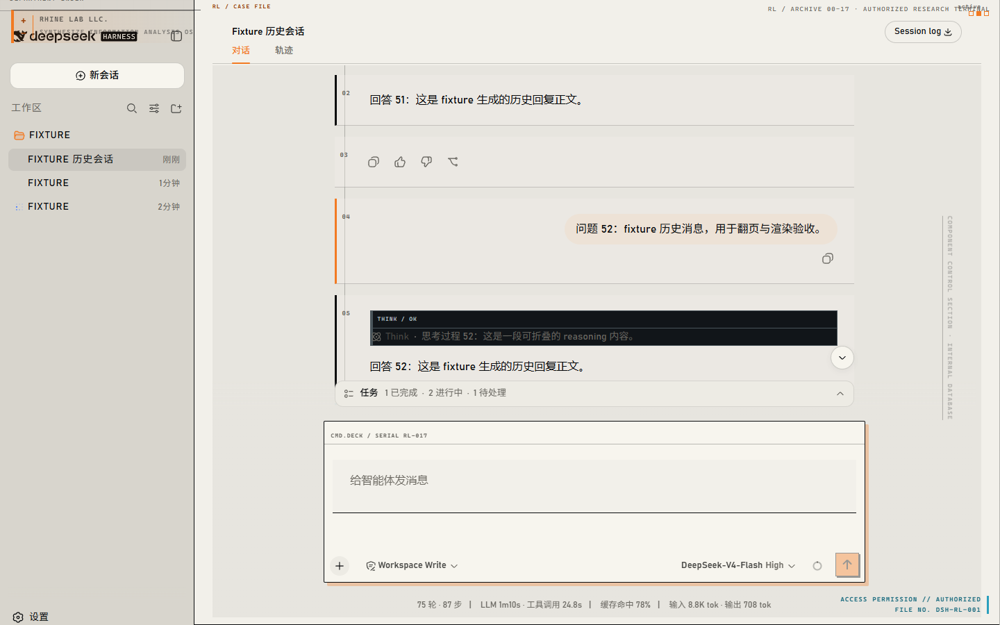
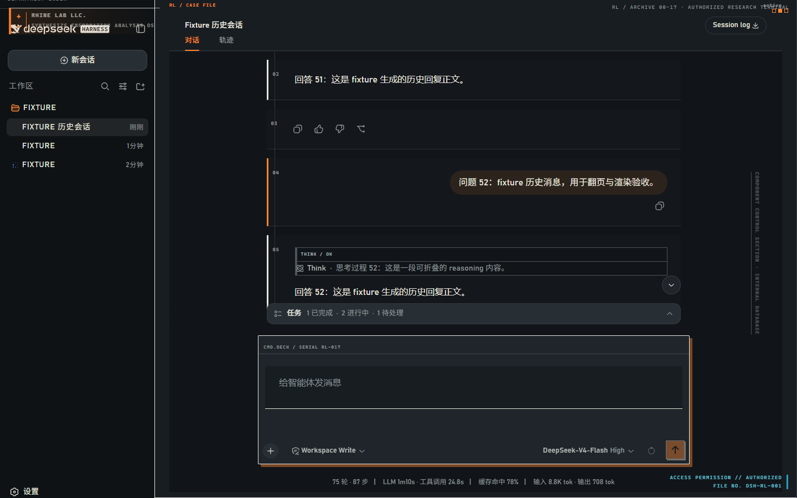

# dsh-theme-rhine-lab

English | [中文](README.zh.md)

> An [Arknights](https://www.arknights.global/) Rhine Lab reconstruction for the [DeepSeek Harness](https://github.com/deepseek-ai/deepseek-harness) Web GUI: an archive-terminal visual system with restrained institutional HUD branding.




## Visual system

The reconstruction presents Harness as a research archive rather than a decorative overlay:

- **Light headquarters archive** uses warm paper, dense ink, squared file edges, and research-orange authorization accents.
- **Dark night-operations mode** keeps the same record structure on charcoal surfaces, with cyan reserved for live data and red for failures.
- **Restrained direct branding** is limited to non-interactive archival labels and the Rhine Lab shell mark; it never adds controls or changes Harness workflow.
- **Accessible behavior** preserves normal interaction, respects `prefers-reduced-motion`, and reduces only nonessential inscriptions and gutters at narrow widths.

No media from any local reference site is redistributed. The package contains only its own source, compiled output, documentation, and the release screenshots above.

## Compatibility and safe degradation

The compatibility target is **DeepSeek Harness 0.1.0-rc.5** on the Web surface (`dsh --profile web`). The stylesheet is deliberately scoped to stable Harness data attributes. If a future or older host omits an anchor, that decoration simply does not apply: the host’s controls, layout tracks, scrolling, code surfaces, and settings remain in charge.

The existing **Settings → General** toggle remains the control point. It still reads and writes the durable `ui-theme-rhine-lab.enabled` preference; no migration or replacement settings namespace is introduced. Light, Dark, and System continue to select the base mode underneath the reconstruction.

## Install

Install a published package or a packed tarball:

```sh
dsh plugin --profile web add dsh-theme-rhine-lab
pnpm pack
dsh plugin --profile web add ./dsh-theme-rhine-lab-0.2.0.tgz
```

Install from source after building it:

```sh
git clone https://github.com/YOU/dsh-theme-rhine-lab.git
cd dsh-theme-rhine-lab
pnpm install
pnpm build
dsh plugin --profile web add .
```

Restart `dsh web` after changing the installed plugin set, then refresh the browser. Git/source installs may require allowing this package’s `prepare` build in the target profile; allow it only when you trust the source.

## How it works

- [`cordis.patch.yml`](cordis.patch.yml) contributes the bundle to dsh.
- [`src/index.ts`](src/index.ts) registers the durable `ui-theme-rhine-lab` setting.
- [`src/client/index.ts`](src/client/index.ts) projects the enabled setting into token overrides, the scoped archive-terminal stylesheet, the non-interactive HUD, and the General-settings row.
- [`lib/`](lib) is committed so registry and tarball installs have prebuilt artifacts.

## Development and publishing

```sh
pnpm test
pnpm build
npm pack --dry-run
```

The published tarball intentionally includes `lib`, `src`, `cordis.patch.yml`, both READMEs, `LICENSE`, and `screenshots` when the release captures are present. It excludes tests, local notes, and any reference-site material.

## License

[MIT](LICENSE). This is a fan-made skin; Arknights and Rhine Lab belong to Hypergryph / Yostar.
